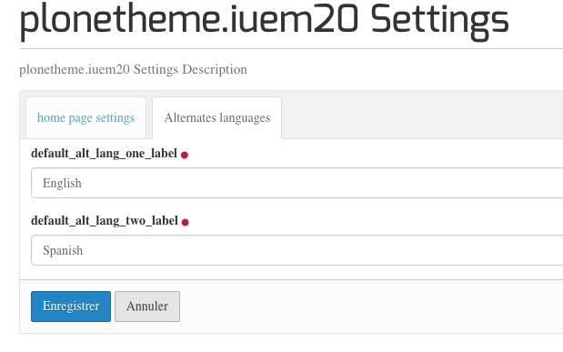
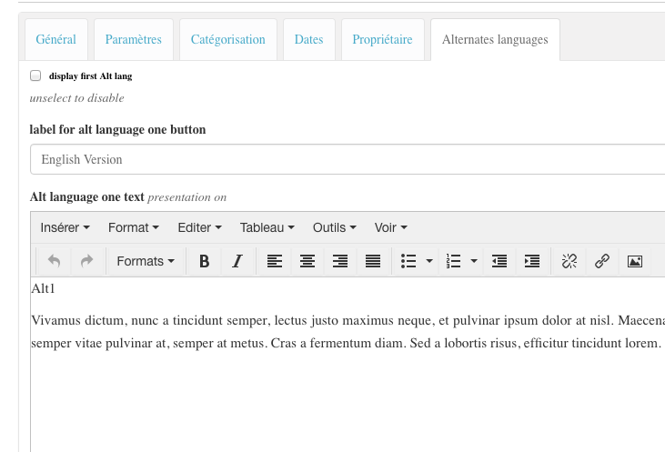

.. include:: links.rst

.. _behaviors:

.. _alt_languages:

=============
Les behaviors
=============

Behavior alt_languages
======================

``plonetheme.iuem20.browser.behaviors.alt_languages.IAltLanguages``

Il permet d'attribuer, à des types de contenus, des champs de texte riche
qui contient la version du type de contenu dans une ou deux langues additionnelles.

Afin de rendre *souple* l'utilisation de ces champs, les libellés sont configurables
par contenu. Cependant, considérant que pour un site donné on utilisera globlalement
les mêmes langues additionnelles, les valeurs par défaut sont configurables
dans le panneau de contrôle du module.

Dans ce module, ce behavior est attribué aux types de contenu suivants :

* Document

* Collection

* Event

* News_Item

Voir les déclarations dans les fichiers ``xml`` correspondants qui se
trouvent dans ``profile/default/types/...``.

Pour chacune des langues optionnelles, on doit saisir 3 champs :

* Afficher ou non le champ *RichText* de cette langue

* le label qui apparaît dans le bouton sur lequel on clique pour faire apparaître
  le texte

* le texte lui-même.

Compte tenu de la similitude de cette fonctionnalité pour les divers types de contenu
qui utilisent ce *behavior*, une viewlet devra être développée et les vues des types
de contenu modifiés afin de prendre en compte cette viewlet.

Dans ce module, ce behavior est pris en compte seulement dans la partie *RichText*
de la home page (et pas sous forme de viewlet, mais dans le code de la viewlet qui
fait le rendu du texte du ``Document`` dont la vue est la vue *Home Page*.

.. note:: les champs de type ``RichText`` sont indexables

Behavior startenddates
======================

``plonetheme.iuem20.browser.behaviors.startenddates.IStartEndDates``

Ce behavior a été developpé pour être utilisé sur les ``News_Item``. Ce qui a pour effet
d'utiliser ces types de contenu de la même façon que ``Event``.

.. note:: de quoi ajouter encore de la confusion pour les utilisateurs entre ces deux
   types de contenus....!

Deux options sont présentes ici :

* afficher ou non ces dates

* afficher ou non l'heure, dans le cas où l'on affiche la date mais que l'on ne veut pas
  que l'heure soit précisée (pour des événements dont la durée est de l'ordre de la journée).

.. note:: les champs ``start_date`` et ``start_date`` sont indexables

.. _thumbnail_behavior:

Behavior thumbnail
==================

Nom du behavior : ``plonetheme.iuem20.browser.behaviors.thumbnail.IThumbnail``

Ce behavior ajoute un champ ``thumbnail`` au type de contenu.

L'utilisation de ce behavior concerne essentiellement la partie ``thumbnails`` de la home
page. Il permet d'afficher, pour chaque élément sélectionné, une vignette adaptée au
contenu.

.. note:: Il est judicieux ici de charger une image de taille réduite afin de ne pas ralentir
   le chargement de la page avec une image de grande taille qui sera rendue, au final,
   en format réduit.

.. note:: le behavior ``plone.app.contenttypes.behaviors.leadimage.ILeadImage`` est
   aussi appliqué aux types de contenu de base mais il s'est avéré préférable d'avoir une
   image dédiée à l'affichage par vignettes.

