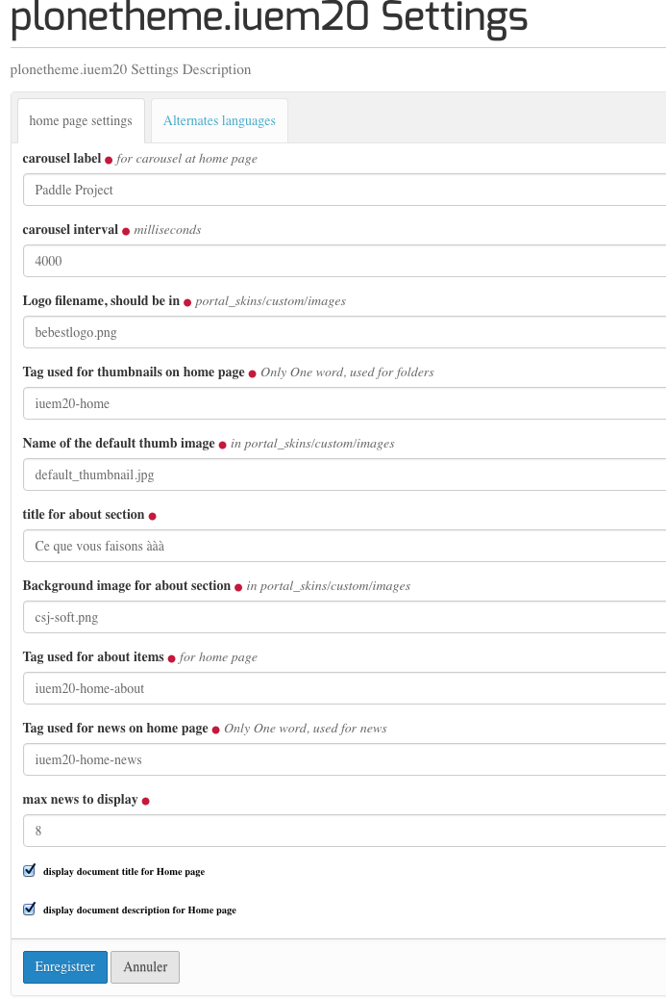

.. include:: links.rst

.. _home:

================
La vue HOME PAGE
================

Introduction
============

Afin de gagner en souplesse d'utilisation, cette vue est exclusivement
composée de `viewlets`_.

Cette façon de procéder présente les avantages suivants :

* un manager de site, même non expérimenté, peut réorganiser la vue en déplaçant les
  viewlets les unes par rapport aux autres, et en masquant des viewlets non désirées.
  Cette réorganisation se fait avec la vue ``@@manage-viewlets``.

* il est simple d'ajouter de nouvelles viewlets, même dans un autre module. Il suffit
  pour cela de déclarer la viewlet membre du viewlet-manager ``iuem20-home``.
  Une viewlet ajoutée peut être une viewlet déjà existante ou un nouveau développement.

Les ressources LESS/CSS de la home page
=======================================

Elles sont contenues dans le fichier ``theme/less/iuem20-home.less``

Chaque viewlet est composée d'une section ayant pour id : ``iuem20-home-`` suivi
du nom de la viewlet.

Par exemple::

   <section id="iuem20-home-carousel"
   ...
   <section id="iuem-20-home-thumbnails"
   ...

Déclarations de la vue
======================

La vue *Home Page* est réservée aux type de contenu ``Document``.

Elle est donc déclarée comme vue additionnelle dans le fichier : ``profiles/default/types/Document.xml``::

   ...
   <property name="view_methods" purge="false">
     <element value="document_view"/>
     <element value="iuem20_home"/>
   </property>
   ...

La déclaration de la vue est faite dans ``browser/configure.zcml``::

   <browser:page
      name="iuem20_home"
      for="*"
      class=".iuem20_home.iuem20Home"
      template="iuem20_home.pt"
      permission="zope2.View"
      />

Compte tenu que cette vue est composée de viewlets, le contenu des deux
éléments de cette vue (``iuem20_home.py`` et ``iuem20_home.pt``) est très réduit.

L'élément important à noter ici est l'utilisation d'une macro ``master`` adaptée :
cette utilisation est donnée dans la directive *metal* de l'entête de la template::

   metal:use-macro="context/iuem20_home_main_template/macros/master"

La template ``iuem20_home_main_template`` est une copie de la template couramment
utilisée pour les vues (``main_template.pt``). Cette dernière est normalement située
dans ``./Products.CMFPlone-5.0.7-py2.7.egg/Products/CMFPlone/browser/templates/main_template.pt``
a été renommée et est placée dans ``plonetheme/iuem20/skins/plonetheme-iuem20/iuem20_home_main_template.pt``.

Les différences entre ces deux templates sont :

* l'instruction ``python:plone_view.patterns_settings()`` a été retirée de la template
  d'origine. Cette instruction a pour but d'ajouter des attributs au ``<body>`` de la page,
  des attributs ``data-pat-*`` utilisés par *PatternsLib*.
  
  .. warning:: bien que cela ne semble pas avoir d'impact sur le rendu de la page,
     cette méthode ne semble pas tout à fait *propre*... à revoir...

* l'appel au viewlet-manager de la home page est ajouté sous ``id="global_statusmessage"``::

   <section id="viewlet-iuem20-home" tal:content="structure provider:iuem20-home" />

La vue @@manage-viewlets
========================

Afin de d'avoir la possibilité de gérer les viewlets, il a fallu aussi adapter la
vue ``@@manage-viewlets``.

C'est ce qui est fait avec la template ``browser/overrides/plone.app.viewletmanager.manage-viewlets.pt``
pour laquelle la macro ``master`` appelée est celle adaptée à la vue home page, c'est à dire::

   metal:use-macro="here/iuem20_home_main_template/macros/master"

Déclaration des viewlets
========================

Le répertoire ``browser/viewlets`` contient le fichier ``configure.zcml`` de déclaration
des viewlets ainsi que les viewlets elle-mêmes, c'est-à-dire les classes python et
les templates associées.

Les viewlets de la home page sont contenues dans le viewlet-manager ``iuem210-home``::

   <browser:viewletManager
       name="iuem20-home"
       ...

Dans ce même ``configure.zcml``, sont déclarées les viewlets associées à ce viewlet-manager::

   <browser:viewlet
       name="iuem20-home-carousel"
       manager="plonetheme.iuem20.browser.viewlets.interfaces.IIUEM20Home"
       class=".iuem20_home_carousel.iuem20HomeCarousel"
       layer="plonetheme.iuem20.interfaces.IPlonethemeIuem20Layer"
       template="iuem20_home_carousel.pt"
       permission="zope2.View"
       />
   
   <browser:viewlet
       name="iuem20-home-thumbnails"
       manager="plonetheme.iuem20.browser.viewlets.interfaces.IIUEM20Home"
       ...

.. note:: c'est donc en ajoutant une nouvelle viewlet à ce viewlet-manager que
   l'on peut ajouter une autre section à la page HOME. 

De plus, le fichier ``profiles/default/viewlets.xml`` contient la liste des viewlets et
leur ordre par défault::

   <order manager="iuem20-home" skinname="Plone Default">
    <viewlet name="iuem20-home-carousel" />
    <viewlet name="iuem20-home-thumbnails" />
    <viewlet name="iuem20-home-news" />
    <viewlet name="iuem20-home-about" />
    <viewlet name="iuem20-home-richtext" />    
   </order>

.. warning:: à chaque désactivation/activation du module, cet ordre par défaut est rétabli.

Configuration de la vue
=======================

Divers paramètres sont à configurer pour cette vue. Cela se passe dans le control-panel
du module :

Ce sont ces paramètres qui sont utilisés lors du rendu de chacune des viewlets.

Cette interrogation du registre est faite par la fonction ``getSettingValue``

.. automodule:: plonetheme.iuem20.utils
   :members: getSettingValue

Viewlet carousel
================

Les images utilisées pour ce carousel doivent être contenues dans un répertoire
nommé ``carousel`` et situé au même niveau que le document visualisé avec la
vue ``iuem20_home``. 

.. note:: Le carousel n'est pas affiché pour un écran de petite taille

**Paramètres du carousel**

+-----------------------+---------------------------------------------------------------------------------------------------------------------------------------------------------------------------+
| paramètre             | Fonction                                                                                                                                                                  |
+=======================+===========================================================================================================================================================================+
| ``carousel_label``    | texte affiché par dessus le défilement des images                                                                                                                         |
+-----------------------+---------------------------------------------------------------------------------------------------------------------------------------------------------------------------+
| ``carousel_interval`` | intervalle de temps, en milisecondes, entre chaque image                                                                                                                  |
+-----------------------+---------------------------------------------------------------------------------------------------------------------------------------------------------------------------+
| ``carousel_logo``     | nom de l'image affichée par dessus le défilement des images. Cela peut être une image ``png``, ``jpeg`` et même ``svg`` qui doit être dans ``portal_skins/custom/images`` |
+-----------------------+---------------------------------------------------------------------------------------------------------------------------------------------------------------------------+

**Le code**

.. automodule:: plonetheme.iuem20.browser.viewlets.iuem20_home_carousel
   :members:
   :undoc-members:

Viewlet thumbnails
==================

Au maximum, 6 vignettes sont affichées. Elles sont recherchées selon un mot clé qui est
donné par le paramètre ``tag_home`` du panneau de configuration.

Il peut s'agir de n'importe quel type de contenu. Dans le cas où le type de contenu
ne dispose pas de champ ``thumbnail`` (voir :ref:`thumbnail_behavior`), la vignette par
défaut affichée est celle désignée par le paramètre ``default_thumb`` du panneau de contrôle.

.. note:: L'odre d'affichage des vignettes des éléments est celui de la date de
   publication. Les éléments publiés en derniers (c'est-à-dire les plus récents)
   sont affichés en premier.

**Paramètres**

+-------------------+------------------------------------------------------------------------------------------------------------------+
| paramètre         | Fonction                                                                                                         |
+===================+==================================================================================================================+
| ``tag_home``      | Mot clé des contenus affichés dans ce tableau de vignettes                                                       |
+-------------------+------------------------------------------------------------------------------------------------------------------+
| ``default_thumb`` | vignette par défaut quand le contenu n'en dispose pas. Cette image doit être dans ``portal_skins/custom/images`` |
+-------------------+------------------------------------------------------------------------------------------------------------------+

**Le code**

.. automodule:: plonetheme.iuem20.browser.viewlets.iuem20_home_thumbnails
   :members:
   :undoc-members:

Viewlet News
============

C'est un carousel des actualités (``News_Item``). Les actualités affichées sont
sélectionnées en fonction du mot clé contenu dans le paramètre ``tag_home_news``.

Le nombre maximal d'actualités affichées est déterminé par le paramètre ``max_news``.

Le temps de défilement des actualités est le même que celui du carousel d'image.

**Paramètres**

+-------------------+---------------------------------------------------+
| paramètre         | Fonction                                          |
+===================+===================================================+
| ``tag_home_news`` | Mot clé des actualités affichées dans ce carousel |
+-------------------+---------------------------------------------------+
| ``max_news``      | Nombre maximal d'actualités                       |
+-------------------+---------------------------------------------------+

.. note:: L'odre d'affichage des actualités est celui de la date de
   publication. Les actualités publiées en derniers (c'est-à-dire les plus récentes)
   sont affichées en premier.

**Le code**

.. automodule:: plonetheme.iuem20.browser.viewlets.iuem20_home_news
   :members:
   :undoc-members:

Viewlet About
=============

Affichage d'un maximum de 3 documents (type de contenu ``Document``) dont le mot clé
est déterminé par le paramètre ``about_document_tag``.

Seule la description des documents est utilisée ici. De ce fait, aucun formatage
n'est rendu (par d'images, pas de liens, etc...). Il s'agit seulement d'une courte
description en trois parties possibles du thème de ce site.

**Paramètres**

+------------------------+----------------------------------------------------------------------------------------------------+
| paramètre              | Fonction                                                                                           |
+========================+====================================================================================================+
| ``about_title``        | Texte du titre de cette section                                                                    |
+------------------------+----------------------------------------------------------------------------------------------------+
| ``about_bg_image``     | Nom de l'image qui décore cette section. Cette image doit être dans ``portal_skins/custom/images`` |
+------------------------+----------------------------------------------------------------------------------------------------+
| ``about_document_tag`` | Mot clé qui permet la sélection des documents                                                      |
+------------------------+----------------------------------------------------------------------------------------------------+

**Le code**

.. automodule:: plonetheme.iuem20.browser.viewlets.iuem20_home_about
   :members:
   :undoc-members:

Viewlet RichText
================

Cette viewlet affiche le texte complet du document concerné. Ce texte n'est affiché
que s'il comprend plus de 6 caractères.

Les différents paramètres gèrent la façon dont le texte est affiché, y compris en tenant
compte du behavior :ref:`alt_languages`.

**Paramètres**

+----------------------------------+-----------------------------------------+
| paramètre                        | Fonction                                |
+==================================+=========================================+
| ``display_document_title``       | Le titre du document est affiché        |
+----------------------------------+-----------------------------------------+
| ``display_document_description`` | La description du document est affichée |
+----------------------------------+-----------------------------------------+

**Le code**

.. automodule:: plonetheme.iuem20.browser.viewlets.iuem20_home_richtext
   :members:
   :undoc-members:

Note à propos de la fonction getHomeObject
==========================================

Cette fonction est utilisée à plusieurs endroits pour le rendu des viewlets de la
page HOME.

Voir ci-dessous la documentation de cette fonction :

.. automodule:: plonetheme.iuem20.utils
   :members: getHomeObject

